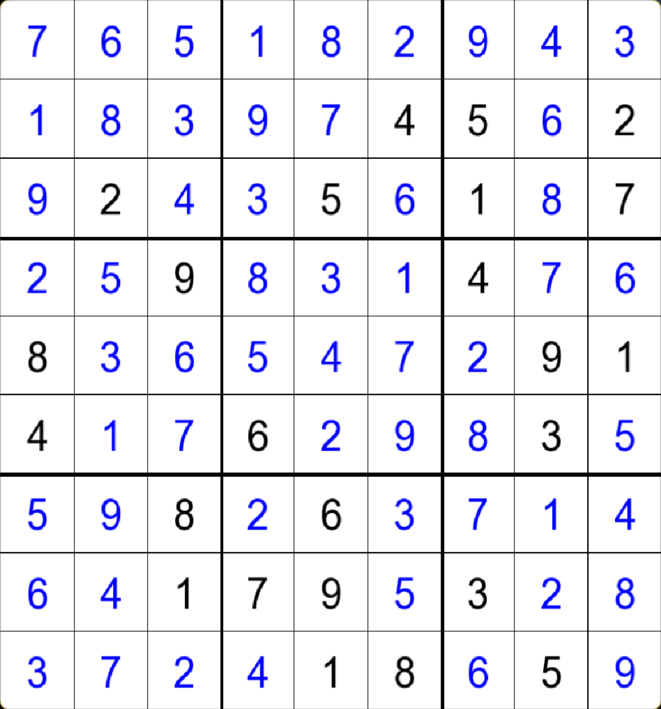

A graphical 9x9 sudoku solver that first uses human techniques (the easy ones such as filling out the last num in a column), when it sees no way to continue with human methods, it moves onto a DFS search method.

Compiling:
```
cd sudoku-solver-v2
mkdir build
mv ARIAL.TTF build/
cd build
cmake ..
make && ./sudoku-solver
```


